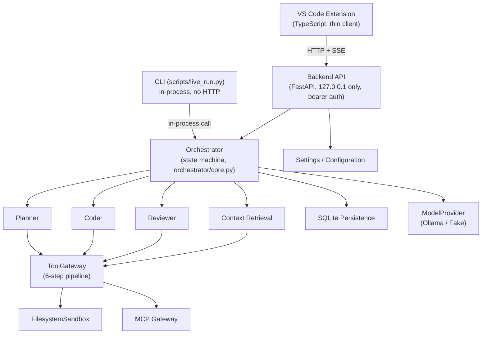

# Agent Platform

A local-first, backend-authoritative software engineering platform. Specialized model
roles (Planner, Coder, Reviewer) operate against a real project on disk through a single
Python backend that owns every security decision, every filesystem write, every piece of
persisted state, and every MCP call. A VS Code extension and a CLI script are both thin
clients over that backend — neither can do anything the backend's permission layer
doesn't already allow.

Everything below was verified against the actual repository at the time of writing:
**1177 backend tests passing, 0 failed, 2 skipped**; a VS Code extension packaged,
installed, and driven through a real end-to-end workflow against real Ollama models.

## Table of Contents

- [Overview](#overview)
- [Why This Exists](#why-this-exists)
- [What It Does](#what-it-does)
- [Architecture](#architecture)
- [Agent Workflow](#agent-workflow)
- [Operating Modes](#operating-modes)
- [Plan Mode](#plan-mode)
- [Context Management](#context-management)
- [Persistent Sessions](#persistent-sessions)
- [MCP Integration](#mcp-integration)
- [Security Architecture](#security-architecture)
- [Configuration](#configuration)
- [Model Management](#model-management)
- [VS Code Extension](#vs-code-extension)
- [Installation](#installation)
- [Running the Platform](#running-the-platform)
- [Example Workflow](#example-workflow)
- [API](#api)
- [Project Structure](#project-structure)
- [Testing](#testing)
- [Live Verification](#live-verification)
- [Performance / Benchmarks](#performance--benchmarks)
- [Known Limitations](#known-limitations)
- [Design Decisions](#design-decisions)
- [Project Evolution](#project-evolution)
- [FAQ](#faq)
- [Future Work](#future-work)

## Overview

Agent Platform is not "an AI coding agent" in the chatbot sense — it's a small
distributed system: a stateful backend that owns a project's filesystem sandbox,
permission model, MCP connections, and SQLite-backed session history, and a set of
thin clients (a VS Code extension, an HTTP API, a CLI script) that talk to it. The
backend runs three specialized model roles — **Planner**, **Coder**, **Reviewer** —
through a deterministic state machine, never letting model output make a security or
persistence decision directly.

Five session types (**Chat**, **Plan**, **Code**, **Edit**, **Review**) share one
backend, one permission evaluator, one filesystem sandbox, and one SQLite database per
project. A session's mode is fixed for its lifetime; switching modes means starting a
new session, never mutating an existing one's authority in place.

## Why This Exists

- **Autonomous implementation needs a validation loop, not a single model call.** The
  Coder's output only reaches disk after passing through the same tool gateway
  every other write goes through, and a Reviewer's approval can never override a real,
  deterministic test failure.
- **Planning before implementation should be a separate, reviewable step.** Plan Mode
  produces a structured specification and a human-readable Markdown artifact, revised
  and explicitly approved before any Coder work begins — not a plan the model silently
  reinterprets mid-implementation.
- **Tool access needs to be permissioned per role, per mode, per concrete path** —
  not "the model has a shell." Every filesystem write is checked against a sandbox that
  rejects path traversal, symlink/junction escapes, UNC/device paths, and drive-relative
  ambiguity, in addition to a role/mode-scoped permission table.
- **A single context window doesn't survive a long-running project.** Context
  retrieval is bounded and priority-ordered; conversation history is compacted into
  checkpoints instead of being truncated or silently dropped.
- **A crashed or restarted backend shouldn't lose a session.** Every session, message,
  decision, specification version, plan snapshot, and checkpoint is durable in SQLite;
  resuming after a restart reconstructs from that store, not from in-memory state.
- **MCP tool access needs the same authority boundary as everything else.** MCP
  capabilities are registered into the exact same `ToolRegistry`/`PermissionEvaluator`
  every other tool uses — there is no separate, weaker MCP permission system.
- **Local models mean local execution.** The default model provider talks to a local
  Ollama instance over HTTP; no code, request text, or credentials are sent to a cloud
  API by anything in this repository.

## What It Does

| Capability | Description |
|---|---|
| Chat | Free-form conversation with the Planner role, read-only tool access. |
| Plan | Structured planning: draft → revise → reviewer critique → explicit approval, with a Markdown artifact and a versioned specification. |
| Code | The full autonomous state machine: implement → test → review → fix-loop → completion, against real tool calls. |
| Edit | Amend an already-approved specification and re-run the implementation loop against the change. |
| Review | Reviewer-only critique of an existing target, independent of an implementation run. |
| Sessions | SQLite-backed sessions, messages, decisions, and checkpoints; survive backend restarts and resume with authoritative state, not a frozen snapshot. |
| Context | Bounded, priority-ordered file retrieval (referenced → changed → dependency → test → config → doc → tree) through the same tool gateway as everything else. |
| MCP | Trusted-config-only server registration; capability = discovery ∩ config ∩ user preference (narrowing only, never additive). |
| Models | Pluggable `ModelProvider` — a real `OllamaModelProvider` (structured JSON output) and a scripted `FakeModelProvider` for deterministic tests. |
| VS Code | A thin-client extension: sidebar session list + one Webview session panel, packaged as an installable VSIX. |
| Security | Deterministic `PermissionEvaluator` + `FilesystemSandbox` + `ToolGateway` pipeline; absolute-deny tools (all git writes, raw shell) that no role or mode can ever unlock. |

## Architecture



Each layer's job:

- **VS Code Extension** — presentation and local process lifecycle only. Never
  evaluates permissions, never touches the filesystem sandbox, never talks to MCP or
  Ollama directly.
- **Backend API** (`backend_api.py`) — the sole HTTP surface. Loopback-only
  (`127.0.0.1`), bearer-token auth checked both by middleware (before route
  resolution) and per-route dependency. Translates HTTP requests into `Orchestrator`
  calls and already-serialized response shapes — no route handler calls
  `ToolGateway`/`PermissionEvaluator`/MCP/the filesystem directly.
- **Orchestrator** (`orchestrator/core.py`) — the state machine and the one place that
  decides which role acts next. Owns one `OperatingMode` for its lifetime.
- **ToolGateway** (`tools/gateway.py`) — the only path from a role's requested tool
  call to actual execution, for every role alike: schema validation → permission
  evaluation → precondition checks → execute → wrap as a `ToolObservation` → log.
- **FilesystemSandbox** (`security/sandbox.py`) — path containment via
  `Path.relative_to` (never string-prefix matching), with reparse-point detection,
  UNC/device-path rejection, and `.git` protection.
- **MCP Gateway** (`mcp/gateway_tools.py`) — registers MCP capabilities as ordinary
  tools in the same `ToolRegistry`/`PermissionEvaluator` every other tool uses.
- **Context Retrieval** (`context/`) — bounded, deterministic file selection, itself
  mediated by the same `ToolGateway`.
- **Persistence** (`persistence/`) — SQLite-backed sessions/messages/decisions/spec
  versions/plan snapshots/checkpoints/tool observations.
- **Settings** (`settings/`) — YAML preference layer; produces inputs to the existing
  trusted constructors, never a second authority.
- **ModelProvider** — `OllamaModelProvider` (real, local) or `FakeModelProvider`
  (scripted, deterministic tests).

## Agent Workflow

Code Mode's state machine (`orchestrator/states.py::State`), the real enum values:

```
RECEIVE_REQUEST
     ↓
    PLAN ──→ AWAITING_USER_INPUT (bounded clarification rounds)
     ↓
VALIDATE_PLAN
     ↓
 IMPLEMENT ──→ BLOCKED ──→ RESOLVE_CLARIFICATION
     ↓
   TEST
     ↓
  REVIEW
     ↓
 FEEDBACK ──→ IMPLEMENT_FIX (bounded fix-loop iterations)
     ↓
FINAL_VALIDATION
     ↓
COMPLETE  (or STUCK ──→ ESCALATE_TO_USER)
```

`COMPLETE` and `ESCALATE_TO_USER` are the only terminal states
(`TERMINAL_STATES` in `states.py`). `AWAITING_USER_INPUT` (routine — the Planner needs
one fact) and `STUCK` (abnormal — iteration exhaustion or a detected stall) are
deliberately distinct states, never merged.

Stall detection (`orchestrator/stall_detection.py`) catches negligible diffs, repeated
identical test failures, and repeated reviewer rejections, and routes to `STUCK` rather
than looping indefinitely.

This is Code Mode's own state machine. The other four session modes map to their own
`Orchestrator` entry points and don't run this full loop:

| OperatingMode | Orchestrator method | Behavior |
|---|---|---|
| CHAT | `run_chat` | Single Planner reply, no plan/implementation state. |
| PLAN | `run_plan` / `revise_plan` / `approve_plan` / `reject_plan` | Draft → revise → approve/reject cycle (see [Plan Mode](#plan-mode)). |
| CODE | `run` | The full state machine above. |
| EDIT | `amend_requirements` | Amends an approved spec, then runs the same implementation loop against the change. |
| REVIEW | `run_review` | Reviewer-only critique of a target, no implementation. |

## Operating Modes

`OperatingMode` (`security/enums.py`) is orthogonal to `Role` (who's acting:
`PLANNER`/`CODER`/`REVIEWER`) and `SessionMode` (how much approval friction applies:
`AUTO`/`CONFIRMATION`/`MANUAL`). It's immutable for the lifetime of one session — a
mode change means creating a new session, never mutating an existing one's authority.

`security/mode_policy.py::MODE_POLICIES` is the additive, per-mode restriction layer
`PermissionEvaluator` consults after its base role/tool table:

| Mode | Allowed roles | Allowed tools | Notes |
|---|---|---|---|
| CHAT | Planner only | read-only filesystem + read-only git | No writes possible. |
| PLAN | Planner, Reviewer | read-only + scoped write | Planner may write **only** inside `.agent/plans/` (`PLAN_SCOPE_DIRECTORY`); enforced by `write_scope` in the mode policy, not by convention. |
| REVIEW | Reviewer only | read-only filesystem + read-only git | No writes possible. |
| CODE | no additional restriction | no additional restriction | Byte-for-byte the pre-Phase-9 permission behavior. |
| EDIT | no additional restriction | no additional restriction | Same as CODE. |

CHAT, PLAN, and REVIEW can only ever **narrow** what the base role/tool table already
allows — they never grant anything CODE/EDIT wouldn't already permit.

## Plan Mode

Plan Mode produces a `StructuredPlan` (`orchestrator/plan_schemas.py`) — objective,
requirements, proposed architecture, files to create/modify, dependencies,
implementation steps, validation strategy, risks, unknowns, acceptance criteria — via
the Planner's structured JSON output, not free text.

Workflow:

1. **Draft** (`run_plan`) — the Planner turns a request into a `StructuredPlan`, or
   asks a clarifying question, or issues bounded research requests.
2. **Artifact write** — the plan is rendered to Markdown (`plan_markdown.py`) and
   written to `.agent/plans/<date>-<spec_id>-spec-v<version>-<slug>.md` through the
   normal `ToolGateway` pipeline (Role.PLANNER, OperatingMode.PLAN, scoped to
   `.agent/plans/`). **The Markdown file is a human-readable artifact only** — editing
   it by hand does not change the authoritative specification; only `approve_plan`
   advances `SpecStore`.
3. **Revise** (`revise_plan`) — re-drafts against reviewer/user feedback; the artifact
   is only overwritten while its status is `DRAFT` or `REVISED`.
4. **Reviewer critique** — a `PlanReview` (comments, missing requirements, security
   concerns, unnecessary complexity) from the Reviewer role.
5. **Approve** (`approve_plan`) — the only place a new `SpecVersion` is actually
   created in `SpecStore`. The Markdown artifact's version number
   (`plan_artifacts.py::predicted_next_version`) is a *prediction*, never a
   reservation — `SpecStore.create()` is the sole source of truth for the real,
   authoritative version.
6. **Reject** (`reject_plan`) — ends the draft cycle with a reason, no spec version
   created.

`spec_id` is validated strictly on every call (`validate_spec_id`) — an invalid id is
**rejected outright**, never sanitized or truncated into something that happens to work
as a filesystem path.

## Context Management

Context retrieval (`context/`) is bounded and deterministic — every read goes through
the same `ToolGateway` every other tool call uses, so it's logged and permissioned
exactly like anything else a role does.

- **Discovery** (`context/discovery.py`) — `walk_project_tree` calls `filesystem.list`
  once per directory (no privileged filesystem access); classifies files as
  test/config/documentation/other; extracts and resolves Python imports to their
  in-tree path; parses `git status` output for changed files. A fixed, auditable
  exclusion list (`is_sensitive_path`) removes `.env*`, `credentials*`, `secrets.*`,
  private-key files (`.pem`/`.key`/`.pfx`/`.p12`/`.ppk`, `id_rsa`/etc.) from the walked
  tree entirely — structural exclusion, not content scanning, so an excluded file can
  never be referenced, read, or become part of any role's context.
- **Bundle construction** (`context/bundle_builder.py`) — candidates are collected in
  priority order (`referenced` → `changed` → `dependency` → `test` → `config` →
  `documentation` → `tree`) and filled until a limit is hit; anything past the limit is
  recorded in `excluded_paths`, never silently dropped.
- **Limits** (`context/limits.py::ContextLimits`) — `max_files=20`,
  `max_total_bytes=200_000`, `max_tokens_estimate=50_000` (a dependency-free ~4
  chars/token estimate), `max_individual_file_bytes=20_000` (oversized files are
  truncated with a flag), `max_retrieval_depth=6`.
- **Staleness** (`context/staleness.py::ContextCache`) — flags a file as stale if its
  content changed since it was last included, rather than silently serving outdated
  content.
- **Role isolation** (`context/role_context.py`) — `build_planner_context` /
  `build_coder_context` / `build_reviewer_context` each build only what that role is
  entitled to see.

Context never grows indefinitely: it's rebuilt bounded on each turn, and the
persistence layer (below) compacts conversation history separately via checkpoints —
the two mechanisms are distinct.

## Persistent Sessions

Every project gets one SQLite database at `<project_root>/.agent/agent.db`
(`persistence/db.py`). Tables: `sessions`, `messages`, `decisions`, `spec_versions`,
`plan_snapshots`, `checkpoints`, `tool_observations`.

- **Append-only history.** `messages`, `decisions`, `spec_versions`,
  `plan_snapshots`, `checkpoints`, and `tool_observations` are never deleted or
  rewritten — the database is always the complete history. `sessions` is the one table
  updated in place (status, active spec version, current checkpoint id, timestamps).
- **Authoritative vs. derived.** `SpecStore` (rehydrated from `spec_versions` at
  startup) and each session's persisted `operating_mode`/`session_mode` are
  **authoritative**. A `CheckpointRecord` is explicitly **derived context** — it can
  never change permissions, the active spec, or operating mode
  (`persistence/service.py`'s module docstring).
- **Compaction** (`persistence/compaction.py`) — triggers when unchecked-since-last-
  checkpoint message tokens cross `context_compaction_threshold_percent` (default 85%)
  of `max_conversation_tokens_estimate` (default 20,000 estimated tokens), or on forced
  milestones (`plan_approved`, `plan_rejected`, `terminal_state`, `archive`).
  Compaction only ever **adds** a checkpoint; it never deletes or truncates the
  underlying messages/decisions.
- **Reconstruction / resume** (`persistence/reconstruction.py`,
  `SessionPersistenceService.resume`) — rebuilds a resumable view from the latest
  checkpoint plus messages since it, checked against
  `checkpoint_max_age_seconds`/staleness rather than trusted blindly.
- **Restart recovery** — `SessionPersistenceService.rehydrate()` replays every
  persisted `SpecVersion` into a fresh `SpecStore` once at backend startup, before any
  session can be created; a corrupted sequence raises and **stops the backend from
  starting** (fail-loud, never serve against possibly-wrong history).
- **Checkpoint integrity** — checkpoints are content-hash verified on read, with
  recovery if the latest checkpoint is corrupted.

Verified live (see [Live Verification](#live-verification)): a real backend process
was stopped and restarted mid-project, and a session resumed with the backend's current
authoritative spec state — not a stale client-side snapshot.

## MCP Integration

- **Trusted config only.** `MCPServerConfig` (`mcp/schemas.py`: `server_id`,
  `transport`, `capabilities`, `credential`) is constructed once from trusted
  configuration (a settings YAML file, resolved through `settings/builder.py`). There
  is no method on `MCPServerConfig` or `MCPServerRegistry` that lets model output, an
  MCP server's own response, or a caller argument create, replace, or mutate a server
  entry after construction.
- **Capability = discovery ∩ config ∩ preference.** `gateway_tools.py` registers a
  capability as a real `mcp.<server>.<capability>` tool only if the server's live
  `discover()` response **and** the trusted config's `capabilities` tuple both include
  it. A compromised or malicious server claiming an extra capability cannot get a tool
  registered for it.
- **Same enforcement, no separate system.** MCP tools flow through the identical
  6-step `ToolGateway` pipeline as `filesystem.write` or `test.run` — there is no
  MCP-specific authority check anywhere.
- **User preferences narrow, never grant** (`mcp/preferences.py`). A preference can
  disable a capability the layers above already established; there is no code path
  from a preference to an `ALLOW` that discovery/config didn't already permit.
- **Credential handling.** Credentials live only in `MCPServerConfig.credential`, set
  once from a resolved credential reference (see [Configuration](#configuration)) and
  never serialized anywhere. `describe_server()` (the API-facing view) **omits** the
  `credential` field entirely rather than masking it — no redaction-bug surface exists
  in the wire format at all.
- **Argument hygiene.** MCP tool calls reject reserved argument keys
  (`server_id`/`credential`/`capability`/`endpoint` — identity/credentials come only
  from trusted config), enforce a JSON-serializability check, and cap argument size at
  50,000 bytes. Responses are passed through `redact_secrets`/`redact_secret_string`
  before returning to a role.

## Security Architecture

```
Role (PLANNER / CODER / REVIEWER)
     ↓
OperatingMode (CHAT / PLAN / CODE / EDIT / REVIEW — security/mode_policy.py)
     ↓
PermissionEvaluator (role × mode × session-mode ceiling × concrete path)
     ↓
ToolGateway (6-step pipeline: schema → permission → preconditions → execute → wrap → log)
     ↓
FilesystemSandbox / MCP capability intersection
```

Permission is evaluated **per invocation with concrete arguments**, never by tool name
alone. `ABSOLUTE_DENY_TOOLS` (`security/permission.py`) — `git.init`, `git.add`,
`git.commit`, `git.push`, `git.reset`, `git.rebase`, `shell.run` — are denied
unconditionally; no role, session mode, or table entry can ever grant them. Git is
human-controlled by design: the agent never commits, initializes, or pushes.

`SessionMode` applies a ceiling on top of the static role/mode grant:
`AUTO`→`ALLOW`, `CONFIRMATION`/`MANUAL`→capped at `CONFIRM`. The effective permission
is always the *lower* of the static grant and the session-mode ceiling.

`FilesystemSandbox` (`security/sandbox.py`) denies by default on any ambiguity:

- Path containment via `Path.relative_to`, never string-prefix matching (a sibling
  directory whose name starts with the workspace name is not treated as "inside").
- Reparse-point (junction/symlink) detection walked on the **unresolved** path chain
  before OS resolution can dereference it — including the workspace root itself at
  sandbox construction time.
- UNC (`\\server\share`) and Windows device-namespace paths rejected outright.
- Drive-relative (`C:foo`) and root-relative (`\foo`) paths rejected as ambiguous —
  never resolved by guessing process state the sandbox has no visibility into.
- Reserved Windows device names (`CON`, `PRN`, `NUL`, `COM1`–`COM9`, `LPT1`–`LPT9`)
  rejected.
- Direct access to `.git` internals denied.
- Plan Mode's write scope (`.agent/plans/`) is enforced as a second `relative_to`
  containment check, not string prefixing.

Security test coverage in the actual test suite includes dedicated adversarial suites:
`test_sandbox_adversarial.py`, `test_mcp_adversarial.py`,
`test_persistence_security_adversarial.py`, `test_settings_security_adversarial.py`,
`test_security_campaign_coverage.py`, `test_security_end_to_end_confirmations.py`,
`test_security_executable_substitution.py`, `test_security_git_config_execution.py`,
and `test_security_known_gaps.py` (which documents accepted, deliberate limitations
rather than hiding them). Areas exercised: path traversal, workspace escape,
symlink/junction escape, UNC/device paths, sibling-prefix attacks, permission
escalation across role/mode boundaries, MCP capability escalation (discovery claiming
more than trusted config permits), credential exposure in API/MCP responses, sensitive
file exclusion from context, settings-driven privilege escalation attempts, and
authentication (missing/wrong token, auth-before-routing on unknown endpoints).

This is **not** a claim of "completely secure." Security tests cover the properties
listed above and are re-run on every change; `test_security_known_gaps.py` exists
specifically to keep unresolved edge cases visible rather than silently accepted. See
[Known Limitations](#known-limitations).

## Configuration

A YAML preference layer (`settings/`) — never a second authority. It only ever produces
**inputs** to the existing trusted constructors (`PlatformConfig.load()`,
`MCPServerConfig`); nothing in `settings/` calls `PermissionEvaluator`, `ToolGateway`,
or `FilesystemSandbox` directly, and it only runs once, at backend startup, from a file
the operator controls — never from model output.

Workspace settings are auto-loaded from `<project_root>/.agent/settings.yaml` if
present (missing file = built-in defaults, unchanged behavior). `SettingsService` also
supports merging a separate **global** layer over the workspace layer
(`SettingsService.load(global_path=..., workspace_path=...)`), with each top-level
section (`models`/`mcp`/`agent_behavior`) overridden wholesale, not deep-merged — but
today's CLI entrypoint (`server.py::build_services`) does not pass a default global
path, so in practice only the workspace file is loaded automatically unless a caller
supplies one explicitly.

Sanitized example (`<project_root>/.agent/settings.yaml`):

```yaml
models:
  planner: example-planner
  coder: example-coder
  reviewer: example-reviewer

mcp:
  github:
    enabled: true
    transport: stdio
    capabilities:
      - search_repositories
      - read_file
    credential: github   # a reference NAME, resolved via an environment variable

agent_behavior:
  session_mode: AUTO
  max_fix_iterations: 3
  context_compaction_threshold_percent: 85
```

Unknown top-level keys, unknown `mcp.<server>` keys, or unknown `agent_behavior` keys
are a hard `SettingsValidationError` at startup — never silently ignored. YAML is
parsed with `yaml.safe_load` only, so a settings file can never construct an arbitrary
Python object.

**Credential references, not credentials.** The `credential:` value above is a
*reference name*, resolved at startup via
`AGENT_PLATFORM_MCP_CREDENTIAL_<NAME_UPPERCASED>` (e.g. `credential: github` →
`AGENT_PLATFORM_MCP_CREDENTIAL_GITHUB`). A settings file can never carry a raw secret
value through this path "by accident" — the input is always treated as a lookup key.

`GET /configuration` and friends return a **safe view**: model names + availability,
per-server `{enabled, transport, capabilities}` (no `credential`/`credential_reference`
field, ever), and effective `agent_behavior` values actually in force post-validation.

**Configuration cannot bypass security authority.** There is no settings field shaped
like a permission grant, a role assignment, a mode policy, or a specification. The only
live-mutable configuration surface is `PUT /mcp/servers/{id}/preferences`, and MCP
preferences can only narrow an already-established capability set, never grant a new
one.

## Model Management

`ModelProvider` (`orchestrator/model_provider.py`) is a `Protocol`, not a base class —
`FakeModelProvider` and `OllamaModelProvider` both satisfy it structurally:

```python
class ModelProvider(Protocol):
    def plan(self, context: dict) -> dict: ...
    def code(self, context: dict) -> dict: ...
    def review(self, context: dict) -> dict: ...
    def plan_mode(self, context: dict) -> dict: ...
    def review_plan(self, context: dict) -> dict: ...
    def chat(self, context: dict) -> dict: ...
    def review_session(self, context: dict) -> dict: ...
```

`OllamaModelProvider` (`orchestrator/ollama_provider.py`) calls a local Ollama HTTP
API with a JSON-schema `format` constraint per role/mode (grammar-constrained
structured output, not free-text parsing). Model **roles**, not specific models, are
what's configurable — `planner`, `coder`, `reviewer` — via `ModelSettings`
(Configuration, above) or the backend's hardcoded fallbacks:

| Role | Default model |
|---|---|
| Planner | `phi4-reasoning:plus` |
| Coder | `qwen2.5-coder:14b` |
| Reviewer | `phi4-reasoning:plus` |

These defaults are the exact models used for this project's own live verification
(below) and its benchmark comparison. Availability discovery
(`settings/model_discovery.py::discover_installed_models`) queries
`GET http://localhost:11434/api/tags`, is fully optional/injectable, and degrades to
"availability unknown" on any network failure rather than blocking backend startup.

## VS Code Extension

**`agent-platform-vscode`** v1.0.0 (publisher `agent-platform`), a thin client only —
the Python backend remains authoritative for permissions, sandboxing, MCP, persistence,
and orchestration.

- **Sidebar** — a native `TreeView` (activity-bar container `Agent Platform`) listing
  sessions; create/refresh from the view title, resume/archive from item context menus.
- **Session panel** — one `WebviewPanel` per active session: chat/plan transcript,
  plan approve/revise/reject buttons, strict per-render-nonce CSP
  (`default-src 'none'`), and a discriminated-union `isIncomingMessage` type guard
  validating every message from the Webview before anything happens.
- **Commands** (11): Start/Stop Backend, New/Open/Resume/Archive/Refresh Session, Open
  Plan Artifact, Reveal Plan Artifact in Explorer, Show Configuration, Edit MCP Server
  Preferences.
- **Backend connection** — two modes, both via `agentPlatform.*` settings:
  **managed** (default — the extension spawns
  `python -m agent_platform.server --workspace-root <folder> --sandbox-root <folder>`
  and reads the one-line startup JSON `{"port", "token"}` from stdout), or
  **external** (`agentPlatform.backendUrl` + `agentPlatform.backendToken`, connecting
  to an already-running backend instead of spawning one).
- **Workspace handling** — the managed backend is spawned with `--sandbox-root` equal
  to the opened folder, so the `FilesystemSandbox` boundary never widens to sibling
  directories.
- **Events** — `GET /sessions/{id}/events` (batched SSE-formatted frames), merging
  plain conversational text with structured decision events into one time-ordered
  stream.
- **Packaging** — built with `tsc`, packaged with `@vscode/vsce` into a VSIX
  containing only compiled `out/src/*.js` + manifest + icon (no `.ts` sources, no test
  files).

## Installation

Requires Python 3.12+, [Ollama](https://ollama.com) with at least one model pulled for
local inference, and (for the extension) VS Code 1.85+ and Node.js.

**1. Backend**

```powershell
git clone <this repository>
cd agent-platform
pip install -e .
pip install fastapi uvicorn pydantic pyyaml requests
```

`pyproject.toml` does not currently declare its runtime dependencies (`fastapi`,
`uvicorn`, `pydantic`, `pyyaml`, `requests`) — install them explicitly as shown above;
this is a known gap, see [Known Limitations](#known-limitations).

**2. Models**

```powershell
ollama pull phi4-reasoning:plus
ollama pull qwen2.5-coder:14b
```

(Or point `models.planner`/`models.coder`/`models.reviewer` in
`.agent/settings.yaml` at whatever you have pulled — see [Configuration](#configuration).)

**3. VS Code extension — build and package**

```powershell
cd vscode-extension
npm install
npm run compile
npx vsce package --out agent-platform-vscode.vsix
```

**4. Install the VSIX**

```powershell
code --install-extension agent-platform-vscode.vsix
```

**5. Use it** — open a project folder in VS Code, open the "Agent Platform" view in
the activity bar, and create a session. The extension spawns the backend for you (managed
mode) unless `agentPlatform.backendUrl` is set.

## Running the Platform

Three independently real launch paths exist in this repository:

**VS Code extension** (managed backend) — described above; no manual backend command
needed.

**HTTP backend directly** (what the extension spawns under the hood, or for driving
via `curl`/a script yourself):

```powershell
python -m agent_platform.server --workspace-root "C:\path\to\your\project" --sandbox-root "C:\path\to\your\project"
```

Prints one JSON line to stdout — `{"port": <int>, "token": "<bearer token>"}` — then
serves on `127.0.0.1:<port>`. `--sandbox-root` is optional; omitted, the
`FilesystemSandbox` boundary defaults to `--workspace-root`'s **parent** directory
(pre-Phase-12 behavior, unchanged). Every route requires
`Authorization: Bearer <token>`, including a route that doesn't exist — auth is
checked before routing.

**CLI, no HTTP, no VS Code** (`scripts/live_run.py`) — the same orchestrator
construction as the automated Ollama integration test, pointed at a real directory:

```powershell
python scripts/live_run.py --workspace-root "C:\Users\you\Scratch" --project hello-world-test --request "Write a single Python file main.py with a function add(a, b) that returns a + b."
```

Prints the internal state-transition trace, the final state, and per-call Ollama
telemetry (load/eval duration, token counts). Leave `--session-mode` at the default
`AUTO` — `CONFIRMATION`/`MANUAL` make writes come back as `requires_confirmation`
observations, and there's no interactive resume path built for that yet (see
[Known Limitations](#known-limitations)).

## Example Workflow

```
Open project in VS Code
        ↓
Open the Agent Platform sidebar → backend spawns automatically
        ↓
New Session → PLAN mode, enter a spec_id
        ↓
Send a request → Planner drafts a StructuredPlan + writes a Markdown artifact
        ↓
Inspect the plan in the session panel
        ↓
Revise (optional) → Planner re-drafts against your feedback
        ↓
Approve → SpecStore records a new, authoritative SpecVersion
        ↓
New Session → CODE mode, same spec_id
        ↓
Send a request → Coder implements, real test/lint/typecheck tools run,
                  Reviewer critiques, bounded fix-loop if needed
        ↓
COMPLETE → the file(s) are actually on disk
        ↓
Stop the backend (or close VS Code)
        ↓
Restart → sessions rediscovered from SQLite
        ↓
Resume the session → authoritative operating_mode and current spec state,
                       not a stale client-side snapshot
```

This exact sequence was run for real against real Ollama models during Phase 12 — see
[Live Verification](#live-verification).

## API

All routes are behind `Authorization: Bearer <token>`, checked before route resolution.

**Sessions**

| Method | Route | Purpose |
|---|---|---|
| POST | `/sessions` | Create a session (`operating_mode`, optional `spec_id`). |
| GET | `/sessions` | List sessions. |
| GET | `/sessions/{id}` | Session detail. |
| POST | `/sessions/{id}/messages` | Send a message; routed internally by the session's `OperatingMode`. |
| GET | `/sessions/{id}/events` | Merged conversational + decision event stream (batched SSE frames). |
| GET | `/sessions/{id}/state` | Current orchestrator state. |
| GET | `/sessions/{id}/history` | Paged message history. |
| GET | `/sessions/{id}/checkpoints` | Persisted checkpoints for the session. |
| POST | `/sessions/{id}/resume` | Reconstruct a resumable view after a restart. |
| POST | `/sessions/{id}/archive` | Force a final checkpoint and mark the session archived. |

**Plans**

| Method | Route | Purpose |
|---|---|---|
| GET | `/sessions/{id}/plan` | Current plan for a PLAN-mode session. |
| POST | `/sessions/{id}/plan/revise` | Revise the draft. |
| POST | `/sessions/{id}/plan/approve` | Approve — creates a new authoritative `SpecVersion`. |
| POST | `/sessions/{id}/plan/reject` | Reject with a reason. |

**Configuration**

| Method | Route | Purpose |
|---|---|---|
| GET | `/configuration` | Safe overall view: models, MCP policy, effective agent-behavior values, precedence info. |
| GET | `/configuration/models` | Configured model ids + availability per role. |
| GET | `/configuration/mcp` | Same server-policy data as `/mcp/servers`, under the configuration namespace. |

**MCP**

| Method | Route | Purpose |
|---|---|---|
| GET | `/mcp/servers` | Configured servers with effective (narrowed) capabilities — never a credential field. |
| PUT | `/mcp/servers/{id}/preferences` | The one live-mutable preference surface — narrowing only. |

## Project Structure

```
agent-platform/
├── src/agent_platform/
│   ├── orchestrator/     state machine, model provider protocol + Ollama/Fake
│   │                     implementations, prompts, plan schemas/artifacts
│   ├── security/         Role/SessionMode/OperatingMode enums, PermissionEvaluator,
│   │                     mode policy table, FilesystemSandbox
│   ├── tools/             ToolGateway, tool registry/schemas, process execution
│   ├── context/           bounded context discovery/retrieval/limits/staleness
│   ├── persistence/       SQLite stores, compaction, reconstruction, service facade
│   ├── mcp/                MCP client/registry/gateway-tools/preferences/secrets
│   ├── settings/           YAML settings loader/builder/credentials/service
│   ├── spec/                SpecStore / SpecVersion (authoritative specification)
│   ├── backend_api.py     FastAPI routes
│   ├── api_serialization.py  explicit, field-by-field response serializers
│   ├── server.py           CLI entrypoint, startup protocol, service wiring
│   └── config.py           PlatformConfig (validated orchestrator-level settings)
├── vscode-extension/
│   ├── src/                extension.ts, sidebarProvider.ts, sessionPanel.ts,
│   │                       backendClient.ts, backendProcess.ts
│   └── test/                Mocha suite (@vscode/test-electron)
├── benchmark/              empirical model-configuration comparison harness + results
├── scripts/live_run.py     manual CLI live-run convenience script
├── tests/                  ~150 pytest files
└── PHASE*_REPORT.md        per-phase implementation/verification reports
```

## Testing

```
python -m pytest tests/ --ignore=tests/test_ollama_integration.py --ignore=tests/test_mcp_real_integration.py -q
→ 1177 passed, 2 skipped, 0 failed
```

The two ignored files (`test_ollama_integration.py`, `test_mcp_real_integration.py`)
require a real running Ollama/MCP server and are run manually, not in the default
suite. The 2 skips are pre-existing environment-specific skips unrelated to this
platform's own logic.

```
cd vscode-extension && npm run compile && node ./out/test/runTest.js
→ 22 passing, 1 pending, 0 failing
```

The 1 pending test is a documented `@vscode/test-electron` environment quirk (see
[Known Limitations](#known-limitations)), not a product defect.

```
npx vsce package --out agent-platform-vscode.vsix   → packages cleanly (~16 KB, 11 files)
code --install-extension agent-platform-vscode.vsix → installs successfully
```

**Why both automated and live testing matter:** the deterministic suites above (fake
model, scripted responses) all passed while several real integration paths were
actually broken — see [Live Verification](#live-verification) for the five bugs live
testing caught that the unit suite did not.

## Live Verification

Run manually (`vscode-extension/test-fixtures/live-e2e-test.js`) against a real spawned
backend and real Ollama models — no scripted responses, no mocked orchestration:

```
Plan → Approve → Code (real Planner→Coder→Reviewer loop) → file written to disk
     → backend restart → session rediscovery → resume with authoritative state
```

Result: **PASSED.** A real `health.py` with a real `is_healthy()` function was written
to disk by the real Coder role; after stopping and restarting the backend process, the
PLAN session was rediscovered and resumed with the correct, current authoritative
`operating_mode` and `spec_version_label`.

Five real backend bugs were found and fixed purely through this live testing, none of
which the deterministic (fake-model) test suite had caught:

1. **CODE/EDIT sessions had no HTTP route at all** — `POST /sessions/{id}/messages`
   only branched on CHAT/PLAN.
2. **No `--sandbox-root` flag existed** to pin the `FilesystemSandbox` boundary to the
   VS Code workspace — a spawned backend could widen writes to sibling directories.
3. **The CLI entrypoint never constructed a model provider** — running the server as a
   real subprocess (exactly how the extension launches it) would always crash.
4. **`OllamaModelProvider` was missing `plan_mode`/`review_plan`/`chat`/
   `review_session`** — Plan Mode had never been exercised against a real model in the
   platform's history, only against `FakeModelProvider`.
5. **Authentication was only checked per-matched-route, not before routing** — an
   unauthenticated request to a nonexistent path returned 404 instead of 401, leaking
   route existence.

All five are fixed, each covered by new tests, with the full backend suite re-verified
green after each fix.

## Performance / Benchmarks

`benchmark/` contains a real, executed comparison harness (`run_all.py`,
`run_repeats.py`, `analysis.py`) comparing two model-role configurations on identical
tasks, iteration caps, context limits, and validator composition:

- **Configuration A** — Planner and Reviewer share weights (`phi4-reasoning:plus` for
  both), Coder is `qwen2.5-coder:14b`.
- **Configuration B** — all three roles use distinct weights
  (`phi4-reasoning:plus` / `qwen2.5-coder:14b` / `llama3.1:8b`).

Actual recorded results (`benchmark/results/analysis_summary.json`, n=20 records
across both configurations):

| Metric (mean) | Config A | Config B |
|---|---|---|
| Wall-clock seconds | 61.8 | 45.7 |
| Model calls | 4.5 | 3.6 |
| Model swaps | 3.3 | 2.3 |
| Tool invocations | 25.4 | 17.9 |
| State transitions | 11.2 | 8.1 |

This is a small, exploratory pilot comparison (n=20 total task runs across both
configurations), not a statistically powered benchmark — treat it as a real but
limited data point on model-role configuration trade-offs, not a general performance
claim. There is no broader, ongoing performance benchmarking infrastructure beyond
this harness.

## Known Limitations

- **Remote SSH — NOT VERIFIED IN CURRENT ENVIRONMENT.** No second machine/SSH target
  was available to test against. The architecture (backend spawned as a child process
  of the VS Code extension host, communicating over `127.0.0.1` only) is designed to
  work identically under Remote SSH, but this has not been exercised.
- **One extension test is skipped, not passing.** `extension.test.ts`'s
  workspace-folder-detection test could not reliably observe
  `vscode.workspace.workspaceFolders` under `@vscode/test-electron` + VS Code 1.133.0
  in this environment, independent of anything in the extension's own code. Real
  workspace-path handling is independently proven by 8 other tests that do pass a real
  workspace root end-to-end into a real backend process, plus the live E2E test.
- **`pyproject.toml` does not declare runtime dependencies.** `fastapi`, `uvicorn`,
  `pydantic`, `pyyaml`, and `requests` must be installed manually (see
  [Installation](#installation)); `pip install -e .` alone will not pull them in.
- **The "global" settings layer isn't wired to a default path.** `SettingsService`
  supports merging a global settings file over a workspace one, and this is tested, but
  the CLI entrypoint never passes a default global-settings path — in practice only
  `<project_root>/.agent/settings.yaml` loads automatically today.
- **`CONFIRMATION`/`MANUAL` session modes have no interactive resume path yet.** A
  write that comes back as `requires_confirmation` currently has nowhere to go except
  `BLOCKED` — there is no UI/API flow to approve an individual confirmation-gated tool
  call.
- **The live E2E test is manual, not CI-wired.** It depends on locally installed
  Ollama models and real inference time (~65s for the full workflow), so it's a
  documented manual verification step, not part of the automated Mocha suite.
- **The benchmark comparison is a small pilot** (see
  [Performance / Benchmarks](#performance--benchmarks)), not a large-scale study.
- **`test_security_known_gaps.py` documents accepted, deliberate security limitations**
  in the current implementation rather than hiding them — consult it directly for the
  authoritative, current list.

## Design Decisions

- **Centralized backend authority.** Every client (VS Code, CLI, future clients) is
  thin; the backend is the only thing that ever evaluates permissions or touches the
  filesystem sandbox. This means a compromised or buggy client can request anything,
  but can never be granted anything the backend wouldn't independently allow.
- **`OperatingMode` as a dimension orthogonal to `Role` and `SessionMode`.** Keeping
  "what kind of session" (mode), "who's acting" (role), and "how much approval
  friction" (session mode) as three independent axes let CHAT/PLAN/REVIEW be added as
  pure *restrictions* without touching CODE/EDIT's existing, already-tested behavior at
  all.
- **`ToolGateway` as a single mandatory pipeline.** No role, no tool type (filesystem,
  git, MCP, test-running) has a privileged shortcut around the six-step pipeline — one
  code path to audit, not N.
- **`FilesystemSandbox` denies on ambiguity, never guesses.** Any path shape the
  sandbox can't be certain about (drive-relative, UNC, an unresolvable reparse chain)
  is rejected outright rather than resolved with a best-effort guess.
- **MCP capability = discovery ∩ trusted config**, never discovery alone. A malicious
  or compromised MCP server can claim any capability it wants; it only becomes a
  callable tool if trusted configuration already listed it.
- **SQLite over a heavier persistence layer.** One file per project, stdlib-only,
  append-only except for the `sessions` table's own status columns — durable and
  simple to reason about without an external service dependency.
- **Checkpoints are derived, never authoritative.** Keeping `SpecStore` and session
  mode/operating-mode columns as the only authoritative state (with checkpoints as
  pure reconstruction aids) means a corrupted or stale checkpoint can never silently
  change what a session is allowed to do.
- **YAML settings as inputs to existing constructors, not a second authority.**
  `settings/` never calls `PermissionEvaluator`/`ToolGateway`/`FilesystemSandbox`
  directly — it only produces the same kwargs a human editing Python literals would
  have produced before Phase 11 existed.
- **A thin VS Code client.** The extension was built last, deliberately, so that every
  security/persistence/orchestration decision it could rely on was already implemented
  and tested — the client adds zero new authority, only presentation.
- **Local-first execution.** The default model provider talks to local Ollama over
  HTTP; nothing in this repository sends project code or credentials to a cloud API.

## Project Evolution

- **Phase 0 — Foundation.** Windows-aware `FilesystemSandbox` and the deterministic
  `PermissionEvaluator`.
- **Phase 1 — Control Plane.** The structured event system, model output schemas, and
  `FakeModelProvider` for deterministic testing.
- **Phase 2 — Model Provider.** The `ModelProvider` protocol, Ollama structured-output
  schemas, and per-role prompt builders.
- **Phase 3 — Validation & Execution.** Real `test.run`/`lint.run`/`typecheck.run`
  tools and `TestRunValidator` — a Reviewer approval can never override a real test
  failure.
- **Phase 4 — MCP Gateway.** `MCPServerConfig`, `MCPServerRegistry`, credential
  redaction, and capability registration into the existing tool/permission tables.
- **Phase 5 — Context Retrieval.** Bounded, priority-ordered context discovery and
  bundle construction.
- **Phase 6 — Autonomous Loop.** Stall detection (negligible diffs, repeated
  failures/rejections) added to `orchestrator/core.py` without touching Phase 0–5.
- **Phase 7 — Adversarial Security Campaign.** A dedicated adversarial test campaign
  against the accumulated security surface.
- **Phase 8 — Empirical SWE Benchmark.** The Configuration A vs. B model-role
  comparison (see [Performance / Benchmarks](#performance--benchmarks)).
- **Phase 9 — Backend Planning Mode.** The first FastAPI backend, Plan Mode's
  draft/revise/approve/reject cycle, and Chat/Review session modes.
- **Phase 10 — Persistent Session & Context Management.** SQLite persistence,
  compaction, reconstruction, and restart/resume.
- **Phase 11 — Configuration, Platform Contracts & Integration.** The YAML settings
  layer, configuration API, and model/MCP visibility routes.
- **Phase 12 — VS Code Extension (final).** The extension itself, five real backend
  bugs found and fixed via live testing, and the full local-install + real live
  end-to-end verification documented in [Live Verification](#live-verification).

Each phase has its own `PHASE<N>_REPORT.md` at the repository root with the full
implementation and verification detail for that phase.

## FAQ

**Is this local-first?** Yes. The backend binds `127.0.0.1` only; the default model
provider talks to a local Ollama instance; there is no cloud infrastructure anywhere in
this repository.

**What models does it use?** Whatever's configured per role (`ModelSettings`) or the
hardcoded fallbacks — `phi4-reasoning:plus` for Planner/Reviewer,
`qwen2.5-coder:14b` for Coder — via a local Ollama instance.

**Does it use Ollama?** Yes, `OllamaModelProvider` is the real provider; a
`FakeModelProvider` exists purely for deterministic automated testing.

**Does it support MCP?** Yes — trusted-config-only server registration, with effective
capability always the intersection of live discovery, trusted configuration, and user
preference (narrowing only).

**Where are sessions stored?** `<project_root>/.agent/agent.db` (SQLite).

**How does context persistence work?** Two distinct mechanisms: bounded, rebuilt-each-
turn context retrieval (`context/`) for what a role sees, and append-only
message/decision history compacted into checkpoints (`persistence/`) for conversation
continuity across restarts.

**Where are plans stored?** `.agent/plans/<date>-<spec_id>-spec-v<version>-<slug>.md`
— a human-readable Markdown artifact. It does not become authoritative by being
hand-edited; only `approve_plan` advances the real `SpecStore`.

**Can configuration bypass permissions?** No. There is no settings field shaped like a
permission grant, role assignment, or mode policy — see
[Configuration](#configuration).

**How is the extension installed?** Build + package with `vsce`, then
`code --install-extension agent-platform-vscode.vsix` — see
[Installation](#installation).

**Can it run over Remote SSH?** Architecturally designed to (the backend is spawned
as a local child process wherever the VS Code extension host itself runs), but **not
verified in the current environment** — see [Known Limitations](#known-limitations).

**Is cloud infrastructure required?** No.

## Future Work

Phase 12 is the final planned development phase — there is no committed Phase 13. The
following are reasonable possibilities suggested by the limitations above, **not**
committed work:

- An interactive resume/approval flow for `CONFIRMATION`/`MANUAL` session modes'
  `requires_confirmation` tool calls.
- Declaring `fastapi`/`uvicorn`/`pydantic`/`pyyaml`/`requests` in `pyproject.toml`
  properly instead of requiring a manual install step.
- Wiring a default global-settings path (e.g. via a CLI flag) so the already-built
  global→workspace precedence is reachable without a caller passing an explicit path.
- Verifying the Remote SSH deployment path on an actual second machine.
- A larger-scale, statistically powered version of the Phase 8 benchmark comparison.
